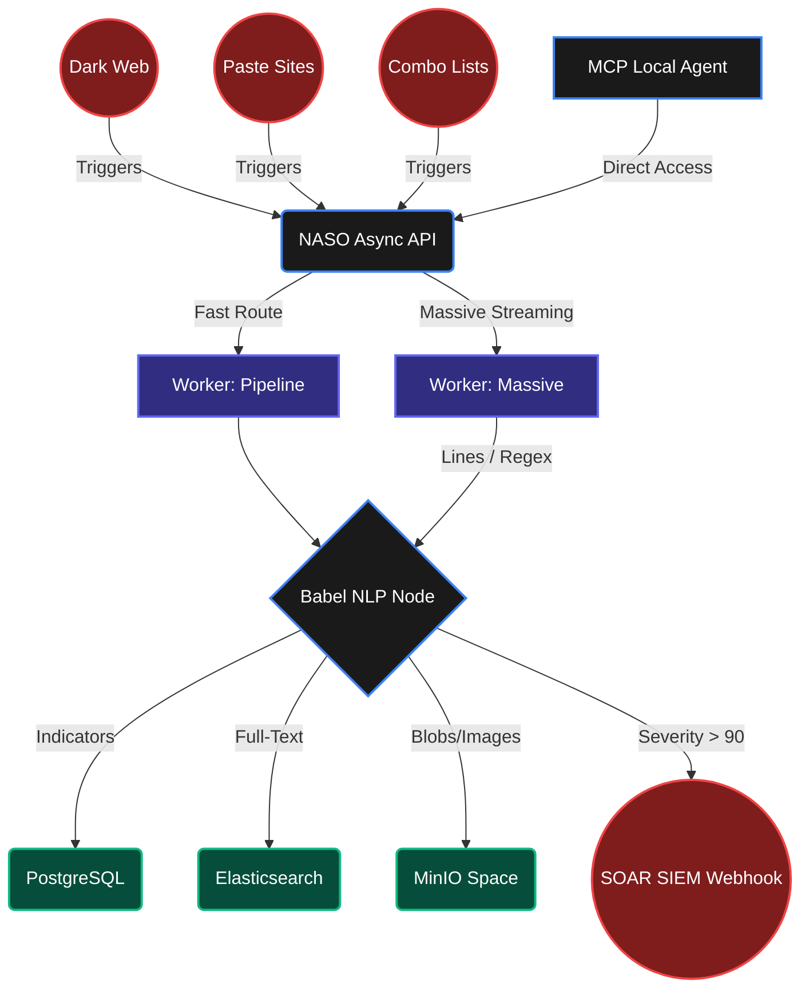

<div align="center">
  
  <h1>NASO Forensic Engine</h1>
  <p>
    <strong>Mission-Critical Cyber Threat Intelligence & OSINT Automation Platform</strong><br/>
    <em>High-performance data breach monitoring, AI correlation, and sovereign data lakes.</em>
  </p>

  <p>
    <a href="https://github.com/fabriziosalmi/naso/actions"></a>
    <a href="https://github.com/fabriziosalmi/naso/network/members"></a>
    <a href="https://github.com/fabriziosalmi/naso/blob/main/LICENSE"></a>
  </p>
</div>

---

NASO is a **Data-Sovereign, High-Performance Intelligence Engine** designed exclusively for enterprise SecOps and Red Teams. It integrates async processing, strict Zero-Trust paradigms, and Local AI (Model Context Protocol) to seamlessly analyze massive dark-web data leaks without exposing PII to external vendors.

## Core Architecture
NASO leverages a partitioned, horizontally scalable backend via Celery Workers separated by task weight (Recon vs Streaming).



## Flagship Features

| Capability | Description |
|---|---|
| **Massive Leak Streaming** | OOM-safe chunk streaming for gigabyte-scale TXT/CSV combos. No RAM saturation even with 100GB files. |
| **Model Context Protocol (MCP)** | Plug your Claude Desktop directly into NASO via a zero-cost local interface for autonomous DB investigation. |
| **The "Babel" Node** | Unicode detection for Russian/Chinese threat forums, triggering local LangChain translation and Entity extraction. |
| **Keyless CTI Adapters** | Automatic, stealthy enrichment via public `blockchain.info` and ThreatFox endpoints *without* paid API keys. |
| **OPSEC Fingerprinting** | Defensive crawling with headless Playwright. Spoofer engine bypasses DDoS-Guard and WAFs with generative canvases. |
| **Fail-Fast Security** | Brutal zero-fallback configuration. No hardcoded credentials to ensure compliance with military deployment schemas. |

## Quick Deployment

NASO relies strictly on `.env` bindings. Before launching, adapt `docker-compose.yml` specs or just run the fast local environment.

```bash
# 1. Prepare Sovereign Environment
cp .env.example .env
# Edit .env and supply rigid PostgreSQL/RabbitMQ passwords

# 2. Deploy the Data Lake
docker-compose up -d --build

# 3. Bootstrap Tables & Identity Maps
docker exec naso-api python init_db.py
```

## Glassmorphism UI
Run the ultra-responsive, GPU-accelerated frontend crafted for CTI analysts.
Navigate to `http://localhost:5173`. Contains real-time Neural Topology Maps, Dark Recon Dashboards, and full SSE streaming for the Co-Analyst.

> **Local AI Note**: If linking an internal AI model like Ollama or LM Studio, verify your `.env` lists `AI_ENDPOINT=http://host.docker.internal:1234/v1` for Docker internal routing.

## Technical Documentation
Explore the full developer and agent orchestration specs in the `docs/` VitePress suite:
* [MCP Server Integration](/docs/guide/mcp-integration)
* [SOAR Architectures & CTI Setup](/docs/guide/soar-and-cti)

To run the docs locally:
```bash
cd docs && npm ci && npm run docs:dev
```

---
*Developed under MIT License pattern. Use responsibly.*
