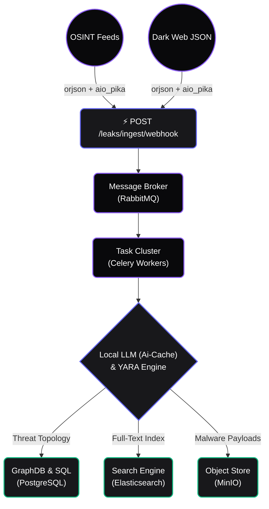

<div align="center">
  
  <h1>NASO Forensic Engine</h1>
  <p>
    <strong>Mission-Critical Cyber Threat Intelligence & OSINT Automation Platform</strong><br/>
    <em>High-performance data breach monitoring, AI correlation, and sovereign data lakes.</em>
  </p>

  <p>
    <a href="https://github.com/fabriziosalmi/naso/actions"></a>
    <a href="https://github.com/fabriziosalmi/naso/network/members"></a>
    <a href="https://github.com/fabriziosalmi/naso/blob/main/LICENSE"></a>
  </p>
</div>

---

**NASO** is a Data-Sovereign, High-Performance Intelligence Engine built for enterprise SecOps and Red Teams. It fuses a non-blocking asynchronous architecture with Local AI (Model Context Protocol), bringing unstructured dark web telemetry into a crisp, actionable canvas.

> [!IMPORTANT]
> **Authorised and defensive use only.** NASO is a dual-use tool. It is built for
> monitoring your own organisation's exposure, incident response, and engagements
> you have written authorisation to perform. Finding a credential in a breach
> corpus does not entitle you to use it, and scanning infrastructure you do not
> own is a criminal offence in most jurisdictions.
>
> Breach data is **personal data**. If you deploy NASO you are the data
> controller under the GDPR and equivalent regimes, with everything that implies.
>
> Read **[LEGAL.md](LEGAL.md)** before pointing NASO at anything.

## Key Features

**🛡️ Draconian Zero-Trust Architecture**
Runs via strictly isolated Docker containers (`cap_drop: ALL`, `no-new-privileges:true`, `read_only` filesystem). Secrets are injected via Docker Secrets into ephemeral RAM mounts. Cryptographic sessions use **EdDSA (Ed25519)** with Redis JTI Blacklisting for instant token revocation.

**⚡ High-Performance Ingestion API**
The ingest webhook (`POST /leaks/ingest/webhook`) uses `orjson` and `aio_pika` to stream raw unstructured data directly into RabbitMQ. Processing is decoupled from the API via Celery workers.

**🧠 Local AI with Semantic Caching**
The backend AI caches semantically similar threat vectors in Redis — your GPU performs analytics only when novel TTPs are observed. The React frontend communicates via SSE with Exponential Backoff retry logic.

**🔍 Identity Correlation Engine**
Master identity merging clusters overlapping indicators across breach sources. Risk scoring is computed from breadth, depth, and recency of exposure. Protected (VIP) identities receive elevated monitoring.

---

## System Architecture

NASO scales horizontally. Computational workflows are offloaded into Celery pools, separating web-serving threads from forensic inferencing.



## Stack

| Component | Technology |
|-----------|------------|
| API | FastAPI (async/await, SQLAlchemy 2.0 async) |
| Task Queue | Celery + RabbitMQ |
| Database | PostgreSQL 15 |
| Cache / Blacklist | Redis 7 |
| Search | Elasticsearch 8 |
| Object Storage | MinIO |
| Tracing | Jaeger (OpenTelemetry) |
| Frontend | React 18 + Vite + Zustand |
| Dark Web | Tor cluster (5 nodes) + HAProxy |
| AI | Local LLM via SSE (Ollama / LM Studio compatible) |

## Zero-to-Hero in 60 Seconds

```bash
git clone https://github.com/fabriziosalmi/naso.git
cd naso
cp .env.example .env
make up
make demo
```

The platform will be available at `http://localhost:5173`.

On first run, set the `NASO_ADMIN_PASSWORD` environment variable (or in `.env`) before running `make demo`, then initialize the admin user:

```bash
export NASO_ADMIN_EMAIL="admin@naso.local"
export NASO_ADMIN_PASSWORD="your_secure_password_here"
docker exec naso-api python init_db.py
make demo
```

## Environment Variables

| Variable | Description |
|----------|-------------|
| `NASO_ADMIN_EMAIL` | Initial admin email (default: `admin@naso.local`) |
| `NASO_ADMIN_PASSWORD` | Initial admin password (required on first run) |
| `DATABASE_URL` | PostgreSQL connection string |
| `AI_ENDPOINT` | Local LLM endpoint (e.g. `http://host.docker.internal:1234/v1`) |
| `AI_MODEL` | LLM model name (default: `gemma-4-e2b-it`) |
| `SOAR_WEBHOOK_URL` | Optional STIX/JSON webhook fired on `severity_score >= 80` |
| `REDIS_URL` | Redis connection string |
| `RABBITMQ_URL` | RabbitMQ connection string |

## CI Validation

The `main` branch is protected by a strict validation pipeline:

```bash
./cli/validate.sh
```

## Documentation

* [Architecture Overview](https://fabriziosalmi.github.io/naso/guide/architecture)
* [Identity Hub](https://fabriziosalmi.github.io/naso/guide/identity-hub)
* [Dark Web Recon](https://fabriziosalmi.github.io/naso/guide/dark-recon)
* [SOAR & CTI](https://fabriziosalmi.github.io/naso/guide/soar-and-cti)
* [MCP Integration](https://fabriziosalmi.github.io/naso/guide/mcp-integration)

## Roadmap

Planned hardening work is tracked in [ROADMAP.md](ROADMAP.md).

## Contributing

Contributions are welcome. Read [CONTRIBUTING.md](CONTRIBUTING.md) for the
development setup, the quality bar, and the commit conventions, and
[CODE_OF_CONDUCT.md](CODE_OF_CONDUCT.md) for how we expect people to behave.

One rule up front: **never contribute real data**. Fixtures, tests, and issue
reports must use synthetic values — never real personal data, real credentials,
or excerpts from a real breach corpus.

## Security

Found a vulnerability? **Do not open a public issue.** Report it privately
through a [GitHub security advisory](https://github.com/fabriziosalmi/naso/security/advisories/new)
or by email. See [SECURITY.md](SECURITY.md) for the process, scope, and safe
harbour terms — and for the hardening checklist you should work through before
running NASO against real data.

## Legal and acceptable use

NASO processes personal data and can reach systems you do not own.
[LEGAL.md](LEGAL.md) covers intended use, authorisation, prohibited uses, your
obligations as a data controller under the GDPR, third-party service terms, and
the absence of any warranty. It is not optional reading.

## License

NASO is licensed under the **[GNU Affero General Public License v3.0](LICENSE)**.

In short: you may use, study, modify, and redistribute NASO freely — but if you
run a modified version as a network service, you must make your modified source
available to its users. See the [full text](LICENSE) for the terms that actually
bind; this summary does not.

Copyright © 2026 Fabrizio Salmi.
