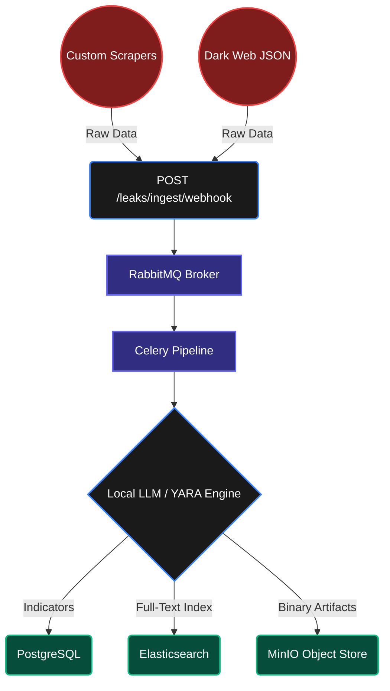

<div align="center">
  
  <h1>NASO Forensic Engine</h1>
  <p>
    <strong>Mission-Critical Cyber Threat Intelligence & OSINT Automation Platform</strong><br/>
    <em>High-performance data breach monitoring, AI correlation, and sovereign data lakes.</em>
  </p>

  <p>
    <a href="https://github.com/fabriziosalmi/naso/actions"></a>
    <a href="https://github.com/fabriziosalmi/naso/network/members"></a>
    <a href="https://github.com/fabriziosalmi/naso/blob/main/LICENSE"></a>
  </p>
</div>

---

NASO is a **Data-Sovereign, High-Performance Intelligence Engine** designed exclusively for enterprise SecOps and Red Teams. It integrates asynchronous processing, strict Zero-Trust paradigms, and Local AI (via Model Context Protocol) to seamlessly analyze massive dark-web data leaks without exposing internal PII to external cloud inference vendors.

## 1. System Architecture

NASO leverages a partitioned, horizontally scalable backend via RabbitMQ and Celery Workers, strictly separated by task computational weight.



## 2. Platform Capabilities (1:1 Codebase Mapping)

### 2.1 Universal Threat Ingestion (BYO-Data)
NASO operates on a "Bring Your Own Data" model. The system exposes a constant, non-blocking webhook (`POST /leaks/ingest/webhook`) that accepts raw, unformatted JSON from any arbitrary external script. The FastAPI layer immediately redirects the payload to the Celery asynchronous pipeline for backend LLM evaluation and YARA rule execution, guaranteeing zero HTTP-thread blockage.

### 2.2 Local AI Co-Analyst & Correlation
Integration with local LLM runtimes (LM Studio, Ollama) operates natively over REST (`/ai/chat`) utilizing Server-Sent Events (SSE). The AI acts natively via defined Tool Calls (`search_identities`, `get_leaks`, `dark_web_probe`) to autonomously evaluate local PostgreSQL telemetry without data exfiltration. 

### 2.3 Force-Directed Topology Graph
The React-based frontend aggregates complex primary keys from the `identity_leaks` SQL table into an interactive 2D Canvas matrix. Nodes utilize dynamic scaling based on graph degree-centrality, ensuring visual isolation of critical compromised assets globally.

## 3. Provisioning & Deployment

NASO infrastructure relies strictly on `.env` bindings and automated Docker provisioning. 

### Step 1: Initialize the Environment
```bash
git clone https://github.com/fabriziosalmi/naso.git
cd naso
cp .env.example .env
# Edit .env and supply rigid PostgreSQL/RabbitMQ passwords
```

### Step 2: Deploy the Sovereign Data Engine
```bash
make up
```

### Step 3: Zero-to-Hero Initialization (Demo Mode)
To immediately populate the system graph with complex, synthetic threat telemetry (VIP accounts, Dark Web breaches, and Mitre mappings) without establishing a live production feed, execute the demo seeder core:
```bash
make demo
```
*Users can verify the live execution at `http://localhost:5173` with credentials `admin@naso.local` / `admin`.*

## 4. Continuous Integration & Draconian Testing

NASO ships with an integrated, multi-layered regression enforcement suite (`cli/validate.sh`). This script executes before commits to guarantee absolute architectural integrity:

1. **Pytest Backend Verification**: Asserts multi-tenant JWT boundaries, simulates disconnected Celery fallback states, and validates the AI tool dispatcher.
2. **Vitest State Machine**: Triggers mock executions against the React/Zustand logic (simulating `HTTP 401 Unauthorized` flushes).
3. **Playwright UI E2E**: Dispatches an embedded headless browser mapping the human forensic flow (Login -> Topology Visualizer -> OSINT Query -> System Logout).

To execute the test matrix:
```bash
./cli/validate.sh
```

## 5. Technical Documentation
Explore the full developer and agent orchestration specs in the `docs/` VitePress suite:

* [MCP Server Integration](https://fabriziosalmi.github.io/naso/guide/mcp-integration)
* [SOAR Architectures & CTI Setup](https://fabriziosalmi.github.io/naso/guide/soar-and-cti)

To compile the documentation locally:
```bash
cd docs && npm ci && npm run docs:dev
```

---
*Developed under MIT License pattern. Mission-critical deployment usage relies on the security posture of the host hypervisor.*
