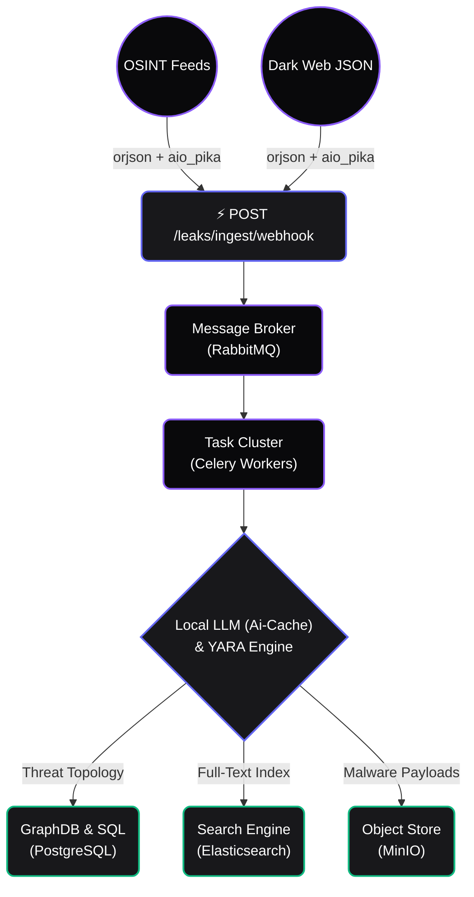

<div align="center">
  
  <h1>NASO Forensic Engine</h1>
  <p>
    <strong>Mission-Critical Cyber Threat Intelligence & OSINT Automation Platform</strong><br/>
    <em>High-performance data breach monitoring, AI correlation, and sovereign data lakes.</em>
  </p>

  <p>
    <a href="https://github.com/fabriziosalmi/naso/actions"></a>
    <a href="https://github.com/fabriziosalmi/naso/network/members"></a>
    <a href="https://github.com/fabriziosalmi/naso/blob/main/LICENSE"></a>
  </p>
</div>

---

**NASO** is a Data-Sovereign, High-Performance Intelligence Engine built for enterprise SecOps and Red Teams. It fuses a non-blocking asynchronous architecture with Local AI (Model Context Protocol), bringing unstructured dark web telemetry into a crisp, actionable canvas.

## Key Features

**🛡️ Draconian Zero-Trust Architecture**
Runs via strictly isolated Docker containers (`cap_drop: ALL`, `no-new-privileges:true`, `read_only` filesystem). Secrets are injected via Docker Secrets into ephemeral RAM mounts. Cryptographic sessions use **EdDSA (Ed25519)** with Redis JTI Blacklisting for instant token revocation.

**⚡ High-Performance Ingestion API**
The ingest webhook (`POST /leaks/ingest/webhook`) uses `orjson` and `aio_pika` to stream raw unstructured data directly into RabbitMQ. Processing is decoupled from the API via Celery workers.

**🧠 Local AI with Semantic Caching**
The backend AI caches semantically similar threat vectors in Redis — your GPU performs analytics only when novel TTPs are observed. The React frontend communicates via SSE with Exponential Backoff retry logic.

**🔍 Identity Correlation Engine**
Master identity merging clusters overlapping indicators across breach sources. Risk scoring is computed from breadth, depth, and recency of exposure. Protected (VIP) identities receive elevated monitoring.

---

## System Architecture

NASO scales horizontally. Computational workflows are offloaded into Celery pools, separating web-serving threads from forensic inferencing.



## Stack

| Component | Technology |
|-----------|------------|
| API | FastAPI (async/await, SQLAlchemy 2.0 async) |
| Task Queue | Celery + RabbitMQ |
| Database | PostgreSQL 15 |
| Cache / Blacklist | Redis 7 |
| Search | Elasticsearch 8 |
| Object Storage | MinIO |
| Tracing | Jaeger (OpenTelemetry) |
| Frontend | React 18 + Vite + Zustand |
| Dark Web | Tor cluster (5 nodes) + HAProxy |
| AI | Local LLM via SSE (Ollama / LM Studio compatible) |

## Zero-to-Hero in 60 Seconds

```bash
git clone https://github.com/fabriziosalmi/naso.git
cd naso
cp .env.example .env
make up
make demo
```

The platform will be available at `http://localhost:5173`.

On first run, set the `NASO_ADMIN_PASSWORD` environment variable (or in `.env`) before running `make demo`, then initialize the admin user:

```bash
export NASO_ADMIN_EMAIL="admin@naso.local"
export NASO_ADMIN_PASSWORD="your_secure_password_here"
docker exec naso-api python init_db.py
make demo
```

## Environment Variables

| Variable | Description |
|----------|-------------|
| `NASO_ADMIN_EMAIL` | Initial admin email (default: `admin@naso.local`) |
| `NASO_ADMIN_PASSWORD` | Initial admin password (required on first run) |
| `DATABASE_URL` | PostgreSQL connection string |
| `AI_ENDPOINT` | Local LLM endpoint (e.g. `http://host.docker.internal:1234/v1`) |
| `AI_MODEL` | LLM model name (default: `gemma-4-e2b-it`) |
| `SOAR_WEBHOOK_URL` | Optional STIX/JSON webhook fired on `severity_score >= 80` |
| `REDIS_URL` | Redis connection string |
| `RABBITMQ_URL` | RabbitMQ connection string |

## CI Validation

The `main` branch is protected by a strict validation pipeline:

```bash
./cli/validate.sh
```

## Documentation

* [Architecture Overview](https://fabriziosalmi.github.io/naso/guide/architecture)
* [Identity Hub](https://fabriziosalmi.github.io/naso/guide/identity-hub)
* [Dark Web Recon](https://fabriziosalmi.github.io/naso/guide/dark-recon)
* [SOAR & CTI](https://fabriziosalmi.github.io/naso/guide/soar-and-cti)
* [MCP Integration](https://fabriziosalmi.github.io/naso/guide/mcp-integration)
