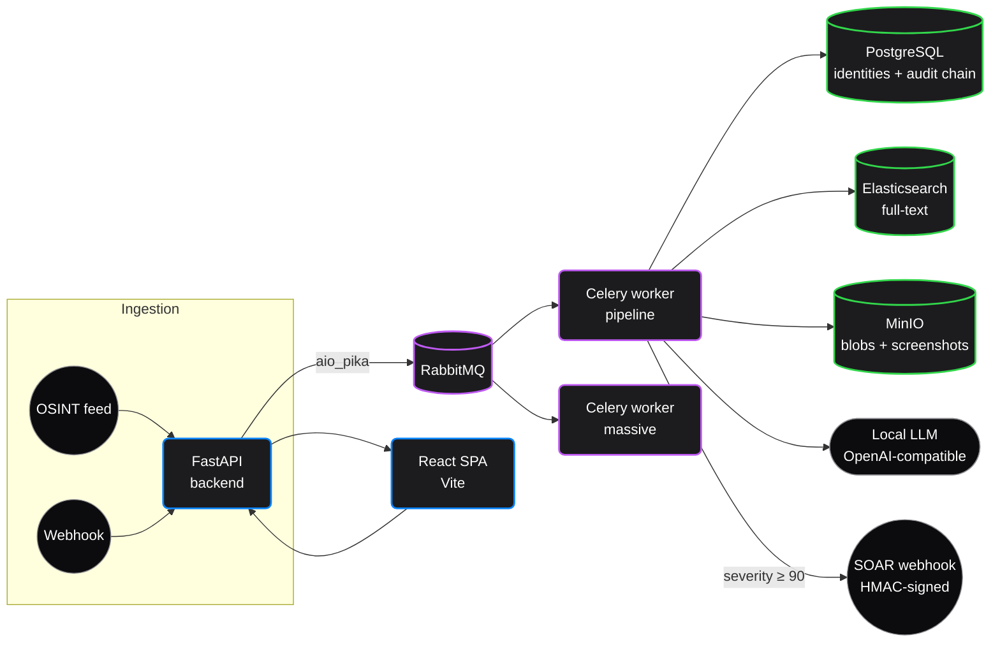

<div align="center">
  
  <h1>NASO Forensic Engine</h1>
  <p>
    <strong>Self-hosted breach monitoring, identity correlation, and local-AI co-analyst.</strong>
  </p>

  <p>
    <a href="https://github.com/fabriziosalmi/naso/actions/workflows/draconian-ci.yml"></a>
    <a href="https://github.com/fabriziosalmi/naso/blob/main/LICENSE"></a>
    <a href="https://www.python.org/downloads/release/python-311/"></a>
    <a href="https://docs.astral.sh/ruff/"></a>
    <a href="https://fabriziosalmi.github.io/naso/"></a>
  </p>
</div>

---

## What it is

NASO ingests breach data from OSINT feeds (Pastebin, Telegram, GitHub, dark-web search via Ahmia/Tor), correlates the identifiers it extracts into a master-identity graph, and gives an analyst a single dashboard plus an LLM co-analyst they can interrogate. It runs entirely on your own hardware — the LLM is whatever local OpenAI-compatible endpoint you point it at (LM Studio, Ollama, …), so the breach data never leaves your network.

## What it isn't

- **Not a SIEM.** No log aggregation, no event correlation across endpoints, no alerting rules language. Bring Splunk / Elastic SIEM / Wazuh for that.
- **Not an EDR.** No endpoint agents, no kernel hooks.
- **Not a turnkey SOC platform.** It's a focused tool for *external* breach intelligence + identity graphing; the rest of the SOC stays where it is.
- **Not battle-tested at scale.** The ingest path is async + queued, the correlation engine has been hardened, but the project hasn't run a real SOC's volume yet. Treat it as early-access.

## Quickstart

```bash
git clone https://github.com/fabriziosalmi/naso.git
cd naso

make bootstrap                              # generate .secrets-mock + .env (idempotent)
export NASO_ADMIN_PASSWORD="choose-one"     # required to seed the first admin
make up                                     # docker compose up -d
docker exec naso-api python init_db.py      # create admin + seed MITRE techniques
make demo                                   # optional: 'Operation Lazarus' synthetic data

open http://localhost:5173
```

That's it. `make bootstrap` generates EdDSA keypair + DB/RabbitMQ/MinIO/ES passwords, populates `.env`, and writes the `.secrets-mock/` directory the compose file binds into `/run/secrets`. Re-running it is a no-op; pass `--force` (or `make bootstrap-force`) to regenerate from scratch.

## Architecture



API + worker are separate processes; tail the broker. Postgres is the source of truth for identities, leaks, merge events, and the hash-chained audit log. Elasticsearch indexes the leak content for analyst search; MinIO holds raw blobs and forensic screenshots. The local LLM is queried over an OpenAI-compatible endpoint (LM Studio, Ollama, vLLM — anything that speaks the chat-completions API).

A deeper writeup with sequence diagrams and the merge ledger schema lives in [`docs/guide/architecture.md`](docs/guide/architecture.md).

## Stack

| Layer        | Choice                                                                                |
|--------------|---------------------------------------------------------------------------------------|
| API          | FastAPI 0.111, SQLAlchemy 2 (async, asyncpg), slowapi rate-limiter                    |
| Auth         | JWT EdDSA (Ed25519), httpOnly cookie + double-submit CSRF, Redis JTI blacklist        |
| Queue        | Celery 5 over RabbitMQ (aio_pika on the API side)                                     |
| Database     | PostgreSQL 15 (hash-chained audit, identity merge ledger)                             |
| Search       | Elasticsearch 8                                                                       |
| Object store | MinIO                                                                                 |
| Observability| OpenTelemetry → OTLP/HTTP (Jaeger all-in-one in dev), Sentry optional                |
| Frontend     | React 18, Vite 6, Zustand, Radix UI, react-force-graph-2d                             |
| Dark web     | 5 × Tor + HAProxy + Ahmia client (rate-limited, circuit-broken, NEWNYM rotation)      |
| AI           | Local OpenAI-compatible LLM via SSE, multi-round ReAct loop with tool calling         |

## Configuration

Every knob lives in `Settings` (see [`shared/config.py`](shared/config.py)). The full env-var reference with defaults, types, and prod overrides is in [`docs/guide/configuration.md`](docs/guide/configuration.md). The minimum you need to touch:

| Variable                | Why                                                            |
|-------------------------|----------------------------------------------------------------|
| `NASO_ADMIN_EMAIL`      | Email of the seed admin user (default `admin@naso.local`)      |
| `NASO_ADMIN_PASSWORD`   | Required at first `init_db.py` run                             |
| `ALLOWED_HOSTS`         | Add your public DNS name (default covers localhost + docker)   |
| `ALLOWED_CORS_ORIGINS`  | Comma-separated SPA origins                                    |
| `AI_ENDPOINT`           | Where your local LLM listens (default `host.docker.internal:1234/v1`) |
| `SOAR_WEBHOOK_URL`      | Optional; alerts at `severity ≥ 90` are POSTed here, HMAC-signed |

Every other variable has a working default for development.

## Security model

- **CSRF**: double-submit cookie (`naso_csrf`) verified on every mutating cookie-authed request — see [`backend/app/csrf.py`](backend/app/csrf.py).
- **Tenant isolation**: every query filters by `tenant_id` for non-admins; covered by `tests/test_api.py::test_leaks_tenant_isolation`.
- **Audit**: hash-chained (SHA-256 over canonical JSON), per-tenant, with Postgres `pg_advisory_xact_lock` + an in-process `asyncio.Lock` to keep concurrent writers serialized — [`shared/utils/audit_chain.py`](shared/utils/audit_chain.py).
- **Forensic dossier**: PDF signed with an Ed25519/RSA key from `NASO_PRIVATE_KEY_PATH` — [`shared/utils/reporting.py`](shared/utils/reporting.py).
- **Container hardening**: `no-new-privileges`, `cap_drop: ALL`, `read_only: true` rootfs with tmpfs for `/tmp` and (workers) `/home/pwuser/.cache`; processes run as uid 10001.
- **TLS verification**: on by default (`ES_VERIFY_CERTS=true`, `MINIO_SECURE` driven by env).
- **Threat model**: written up in [`docs/guide/security.md`](docs/guide/security.md).

## Running the tests

```bash
make test                      # backend pytest (in container) + vitest (host)
./cli/validate.sh              # full draconian sequence: pytest + vitest + playwright
```

The CI workflow ([`.github/workflows/draconian-ci.yml`](.github/workflows/draconian-ci.yml)) runs ruff, the backend tests against in-memory SQLite, the vitest suite, and a docker-compose smoke that fails loud on a backend container that crash-loops. Dependency scanning runs in a separate workflow ([`security-scan.yml`](.github/workflows/security-scan.yml)) on PRs that touch manifests and weekly.

## Documentation

The docs site is built with VitePress and lives at [fabriziosalmi.github.io/naso](https://fabriziosalmi.github.io/naso/). Deep dives:

- [Architecture](docs/guide/architecture.md) — runtime layout, sequence diagrams, schema
- [Configuration](docs/guide/configuration.md) — every env var
- [Security](docs/guide/security.md) — threat model, hash chain, CSRF, container posture
- [Deployment](docs/guide/deployment.md) — production compose + reverse proxy + backup
- [Runbook](docs/guide/runbook.md) — operational playbooks (Tor down, LLM offline, key rotation)
- [Identity Hub](docs/guide/identity-hub.md) — normalization, SimHash dedup, merge ledger
- [Dark Web Recon](docs/guide/dark-recon.md) — AhmiaClient, circuit breaker, NEWNYM
- [AI Co-Analyst](docs/guide/ai-coanalyst.md) — ReAct loop, tool catalog, system prompt
- [SOAR & CTI](docs/guide/soar-and-cti.md) — outbound webhook (HMAC), CTI adapters
- [MCP Integration](docs/guide/mcp-integration.md) — Claude Desktop config
- [Reporting](docs/guide/reporting.md) — signed PDFs, dossier flow

## Contributing

See [`docs/guide/contributing.md`](docs/guide/contributing.md). Short version:

```bash
pip install pre-commit && pre-commit install   # ruff + actionlint + hygiene on every commit
ruff check . && ruff format --check .          # what CI gates on
```

Open a PR against `main`. Issues for bugs, ideas, security reports.

## License

Released under the [MIT License](LICENSE).
