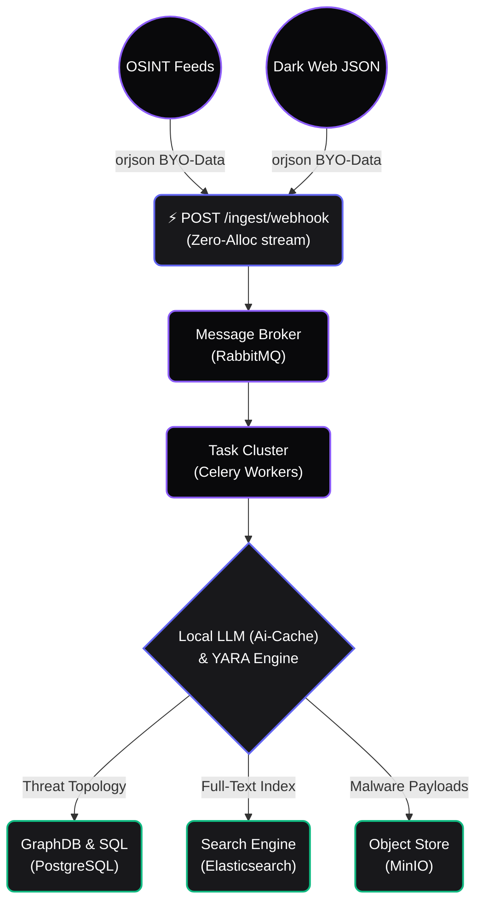

<div align="center">
  
  <h1>NASO Forensic Engine</h1>
  <p>
    <strong>Mission-Critical Cyber Threat Intelligence & OSINT Automation Platform</strong><br/>
    <em>High-performance data breach monitoring, AI correlation, and sovereign data lakes.</em>
  </p>

  <p>
    <a href="https://github.com/fabriziosalmi/naso/actions"></a>
    <a href="https://github.com/fabriziosalmi/naso/network/members"></a>
    <a href="https://github.com/fabriziosalmi/naso/blob/main/LICENSE"></a>
  </p>
  
  <!-- PLACEHOLDER FOR DEMO GIF OVERVIEW -->
  <!--  -->
</div>

---

**NASO** is a Data-Sovereign, High-Performance Intelligence Engine built for enterprise SecOps and Red Teams. It fuses a non-blocking asynchronous architecture with Local AI (Model Context Protocol), bringing unstructured dark web telemetry into a crisp, actionable canvas.

## ✨ State-Of-The-Art Features

<details>
<summary><b>🛡️ Draconian Zero-Trust Architecture</b></summary>
<br>
Runs via strictly isolated eBPF-minded Docker containers (<code>cap_drop: ALL</code>, <code>no-new-privileges:true</code>). Secrets aren't hardcoded in environments; they are injected via <b>Docker Secrets</b> into ephemeral RAM mounts. Cryptographic sessions are upheld by <b>EdDSA (Ed25519)</b> and instantly invalidated via Redis JTI Blacklisting.
</details>

<details>
<summary><b>⚡ Zero-Allocation Ingestion API</b></summary>
<br>
The ingest webhook (<code>POST /leaks/ingest/webhook</code>) utilizes <code>orjson</code> and <code>aio-pika</code> to cast raw unstructured BYO-Data straight into the <b>RabbitMQ</b> native socket stream. This evades Python's heap allocation limits, processing vast GBs of leaks with zero memory spikes.
</details>

<details>
<summary><b>🧠 Local AI Semantic Caching</b></summary>
<br>
NASO ships with a robust React Zustand frontend that features a rock-solid <b>Exponential Back-off SSE</b> engine. The backend AI protects your VRAM computational limits by caching matching Semantic Threat vectors (SHA-256) inside <b>Redis</b>. Your GPU performs analytics only when novel TTPs are observed.
</details>

---

## 🏗 System Architecture

NASO scales horizontally. Computational workflows are offloaded into Celery pools, separating web-serving threads from forensic inferencing.



## 🚀 Zero-to-Hero in 60 Seconds

NASO infrastructure relies strictly on self-contained Docker orchestration. 

### 1. Initialize
```bash
git clone https://github.com/fabriziosalmi/naso.git
cd naso
cp .env.example .env
```

### 2. Ignite Engine
```bash
make up
```

### 3. Deploy "Operation Lazarus" Demo
Don't have real live Dark Web data right now? NASO features an integrated, Hollywood-style CLI seeder built with `rich` that synthetically maps out VIP accounts, threat telemetry, and YARA-triggered simulated breaches directly into your database.
```bash
make demo
```
*Visit the glassmorphism frontend at `http://localhost:5173`.*
*(Credentials: `admin@naso.local` / `admin`)*

---

## 🛡️ CI Validation (Draconian)

The `main` branch is protected by strict internal validations simulating real REST loads:

```bash
# Triggers the massive End-to-End simulation testing
./cli/validate.sh
```

## 📚 Official Docs

Explore developer documentation and Model Context Protocol setups inside the `docs/` VitePress suite:
* [Core Platform Setup & MCP](https://fabriziosalmi.github.io/naso/guide/mcp-integration)
* [BYO-Data Threat Ingestion](https://fabriziosalmi.github.io/naso/guide/soar-and-cti)
