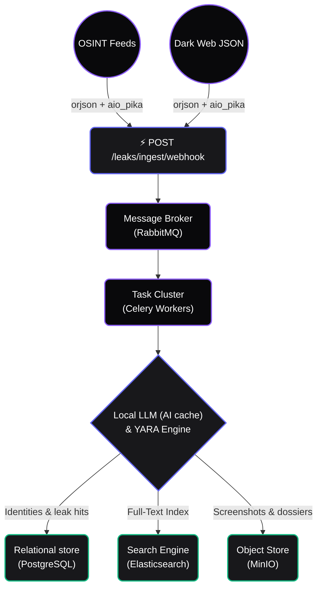

<div align="center">
  
  <h1>NASO Forensic Engine</h1>
  <p>
    <strong>Breach and dark-web exposure monitoring, self-hosted</strong><br/>
    <em>Ingest, correlate identities, and triage with a local LLM — on infrastructure you control.</em>
  </p>

  <p>
    <a href="https://github.com/fabriziosalmi/naso/actions"></a>
    <a href="https://github.com/fabriziosalmi/naso/network/members"></a>
    <a href="https://github.com/fabriziosalmi/naso/blob/main/LICENSE"></a>
  </p>
</div>

---

**NASO** watches breach corpora, paste sites, public GitHub, Telegram channels and
onion services for your organisation's exposure, correlates what it finds into
identities, and triages it with a language model you run yourself. Every
component — database, search index, object store, LLM — runs in your own Compose
stack; nothing leaves it. That is the whole design constraint: this software
handles other people's personal data, and the safest place for it is somewhere
you can point at.

> [!IMPORTANT]
> **Authorised and defensive use only.** NASO is a dual-use tool. It is built for
> monitoring your own organisation's exposure, incident response, and engagements
> you have written authorisation to perform. Finding a credential in a breach
> corpus does not entitle you to use it, and scanning infrastructure you do not
> own is a criminal offence in most jurisdictions.
>
> Breach data is **personal data**. If you deploy NASO you are the data
> controller under the GDPR and equivalent regimes, with everything that implies.
>
> Read **[LEGAL.md](LEGAL.md)** before pointing NASO at anything.

## Key Features

**🛡️ Hardened Container Baseline**
The API and worker containers run as uid 10001 with `cap_drop: ALL`, `no-new-privileges:true`, and a `read_only` root filesystem. The JWT signing keys are mounted as files under `/run/secrets` and never appear in the environment; the datastore passwords the application connects with come from `.env`, which `make bootstrap` renders with the same generated values the containers are provisioned from. Sessions are **EdDSA (Ed25519)** with `iss`/`aud`/`nbf` verified on every decode, and Redis JTI blacklisting for immediate revocation.

> The shipped `docker-compose.yml` is a development and evaluation baseline, not a production configuration — it mounts generated secrets from a local directory and publishes management ports. See [SECURITY.md](SECURITY.md#operator-responsibilities) before running it against real data.

**⚡ High-Performance Ingestion API**
The ingest webhook (`POST /leaks/ingest/webhook`) uses `orjson` and `aio_pika` to stream raw unstructured data directly into RabbitMQ. Processing is decoupled from the API via Celery workers.

**🧠 Local AI with Response Caching**
Answers are cached in Redis under a SHA-256 key over the conversation history **and the tenant id**, so a repeated question returns without touching the model and no cache entry can be shared across tenants. The React frontend consumes the stream over SSE with exponential-backoff-and-jitter reconnection.

**🔍 Identity Correlation Engine**
Master identity merging clusters overlapping indicators across breach sources. Risk scoring is computed from breadth, depth, and recency of exposure. Protected (VIP) identities receive elevated monitoring.

---

## System Architecture

Ingestion is decoupled from processing: the API publishes to RabbitMQ and returns, and Celery workers do the analysis. Two worker pools, because the workloads are different — `worker-pipeline` runs the per-hit path at concurrency 4, `worker-massive` runs bulk dump processing at concurrency 1 so one large job cannot starve the rest.



## Stack

| Component | Technology |
|-----------|------------|
| API | FastAPI (async/await, SQLAlchemy 2.0 async) |
| Task Queue | Celery + RabbitMQ |
| Database | PostgreSQL 15 |
| Cache / Blacklist | Redis 7 |
| Search | Elasticsearch 8 |
| Object Storage | MinIO |
| Tracing | Jaeger (OpenTelemetry) |
| Frontend | React 18 + Vite + Zustand |
| Dark Web | Tor cluster (5 nodes) + HAProxy |
| AI | Local LLM via SSE (Ollama / LM Studio compatible) |

## Getting Started

Requirements: Docker with Compose v2, Python 3.11, Node 20.

```bash
git clone https://github.com/fabriziosalmi/naso.git
cd naso

# 1. Generate .secrets-mock/ (docker-compose mounts it at /run/secrets and
#    will not start without it) and render .env with the same values.
make bootstrap

# 2. Bring up Postgres, Redis, Elasticsearch, MinIO, RabbitMQ, Jaeger, the
#    Tor cluster, the API, and the workers — fifteen containers.
make up
```

`make bootstrap` fills in every credential it generates, so there is nothing to
edit before `make up`. What is left blank in `.env` is optional and annotated:
third-party API keys (`SHODAN_API_KEY`, the Telegram pair), the AI endpoint, and
the tracing toggle.

The API is then on `http://localhost:8000`. **The frontend is not part of the
Compose stack** — it runs as a Vite dev server on the host:

```bash
cd frontend
npm install
npm run dev          # http://localhost:5173
```

Create the schema, provision the first admin, and seed synthetic data:

```bash
docker exec naso-api python init_db.py   # create_all + alembic upgrade head + admin
make demo                                # 100+ synthetic leak artefacts
```

`init_db.py` reads `NASO_ADMIN_EMAIL` and `NASO_ADMIN_PASSWORD` **from the
container's environment**, which Compose populates from `.env` — exporting them
in your own shell before `docker exec` does nothing, because that shell is not
where the process runs. `make bootstrap` has already generated a password; read
it out of `.env`, or set your own there before `make up`:

```bash
grep '^NASO_ADMIN_' .env
```

> Do not give the admin an address under `.local`, `.test`, `.localhost`,
> `.invalid`, `.arpa`, or `.onion`. Those are special-use TLDs and the API's
> `EmailStr` validation rejects them, so `/users/me` would fail for that
> account.

## Environment Variables

[`.env.example`](.env.example) is the complete, annotated reference. The
variables you are most likely to touch:

| Variable | Description |
|----------|-------------|
| `NASO_ADMIN_EMAIL` | Initial admin email (default: `admin@naso.example.com`) |
| `NASO_ADMIN_PASSWORD` | Initial admin password — **required** on first run |
| `DATABASE_URL` | PostgreSQL connection string used by the application |
| `REDIS_HOST` | Redis connection URL, used for the JWT blacklist |
| `RABBITMQ_HOST` / `RABBITMQ_USER` / `RABBITMQ_PASS` | Celery broker — a worker will not start without the credentials |
| `AI_ENDPOINT` | Local LLM endpoint (e.g. `http://host.docker.internal:1234/v1`) |
| `AI_MODEL` | LLM model name (default: `gemma-4-e2b-it`) |
| `NASO_OTEL_ENABLED` | Opt in to OTLP tracing. Off by default |
| `SOAR_WEBHOOK_URL` | Optional JSON webhook fired on `severity_score >= 90` |
| `NASO_COOKIE_SECURE` | Set to `true` in production, behind HTTPS |

Note that several services take one variable to provision the container and a
different one for the application to connect with (`ELASTIC_PASSWORD` vs
`ES_PASSWORD`, `RABBIT_USER` vs `RABBITMQ_USER`, `MINIO_ROOT_USER` vs
`MINIO_ACCESS_KEY`). `.env.example` marks every such pair.

## Validation

`cli/validate.sh` is what CI runs on every pull request against `main`. Two
gates first — every container has to reach a steady `running` state, and
`GET /system/health` has to report every component `ok` or `disabled` — then
backend pytest inside the API container, frontend Vitest, and the Playwright
end-to-end flows:

```bash
./cli/validate.sh
```

## Documentation

* [Architecture Overview](https://fabriziosalmi.github.io/naso/guide/architecture)
* [Identity Hub](https://fabriziosalmi.github.io/naso/guide/identity-hub)
* [Dark Web Recon](https://fabriziosalmi.github.io/naso/guide/dark-recon)
* [SOAR & CTI](https://fabriziosalmi.github.io/naso/guide/soar-and-cti)
* [MCP Integration](https://fabriziosalmi.github.io/naso/guide/mcp-integration)

## Roadmap

Planned hardening work is tracked in [ROADMAP.md](ROADMAP.md).

## Contributing

Contributions are welcome. Read [CONTRIBUTING.md](CONTRIBUTING.md) for the
development setup, the quality bar, and the commit conventions, and
[CODE_OF_CONDUCT.md](CODE_OF_CONDUCT.md) for how we expect people to behave.

One rule up front: **never contribute real data**. Fixtures, tests, and issue
reports must use synthetic values — never real personal data, real credentials,
or excerpts from a real breach corpus.

## Security

Found a vulnerability? **Do not open a public issue.** Report it privately
through a [GitHub security advisory](https://github.com/fabriziosalmi/naso/security/advisories/new)
or by email. See [SECURITY.md](SECURITY.md) for the process, scope, and safe
harbour terms — and for the hardening checklist you should work through before
running NASO against real data.

## Legal and acceptable use

NASO processes personal data and can reach systems you do not own.
[LEGAL.md](LEGAL.md) covers intended use, authorisation, prohibited uses, your
obligations as a data controller under the GDPR, third-party service terms, and
the absence of any warranty. It is not optional reading.

## License

NASO is licensed under the **[GNU Affero General Public License v3.0](LICENSE)**.

In short: you may use, study, modify, and redistribute NASO freely — but if you
run a modified version as a network service, you must make your modified source
available to its users. See the [full text](LICENSE) for the terms that actually
bind; this summary does not.

Copyright © 2026 Fabrizio Salmi.
