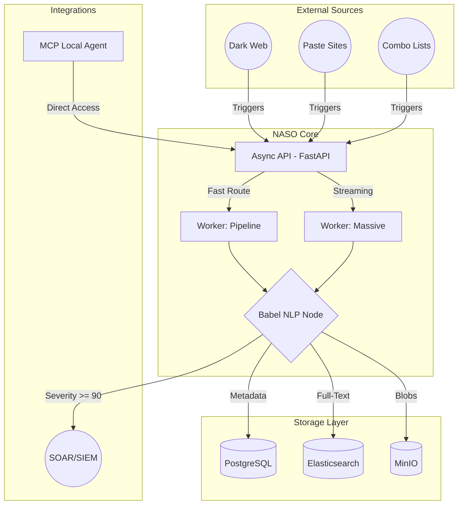

# Architecture

NASO is engineered as a heavily decoupled, containerized microservices platform optimized for high-throughput forensic evidence processing.

## System Overview

## 1. Web Layer (FastAPI)

The API server is built on FastAPI with full async/await support. All database interactions use SQLAlchemy 2.0's asynchronous API with the `asyncpg` PostgreSQL driver.

- **Connection Pooling**: Configurable via `DB_POOL_SIZE` (default: 20) and `DB_MAX_OVERFLOW` (default: 10).
- **Authentication**: OAuth2 Bearer tokens with JWT (EdDSA / Ed25519). Token expiry configurable via `ACCESS_TOKEN_EXPIRE_MINUTES`.
- **Multi-Tenancy**: Every data query is scoped to `tenant_id` by default. Admin-role users can bypass tenant isolation for global views.

## 2. Worker Pipeline (Celery)

The ingestion engine is decoupled from the API layer via Celery workers backed by RabbitMQ.

### Worker Separation

| Worker | Queue | Concurrency | Purpose |
|---|---|---|---|
| `worker-pipeline` | `default`, `osint` | 4 | Standard OSINT scraping, identity merging |
| `worker-massive` | `massive` | 1 | Gigabyte-scale streaming file processing |

### Security Hardening

All worker containers run with:

- `no-new-privileges: true`
- `cap_drop: ALL`
- `read_only: true` filesystem (with `tmpfs` for scratch)
- Memory and CPU resource limits enforced via Docker `deploy.resources`

## 3. Storage Hierarchy

### PostgreSQL (Relational Metadata)
Primary store for users, tenants, identities, leak records, investigation plans, audit logs, YARA rules, and webhook configurations.

### MinIO (Object Storage)
Binary artifacts: forensic screenshots, raw data blobs, and exported dossier PDFs.

### Elasticsearch (Search Index)
Full-text search across leak content snippets and metadata, enabling sub-millisecond retrieval for analyst queries.

## 4. Tor Cluster

A fleet of 5 Tor containers behind an HAProxy load balancer provides anonymized dark web access. All Tor traffic is isolated within the internal Docker bridge network.

## 5. Observability

- **Distributed Tracing**: Jaeger (OpenTelemetry) is deployed as a sidecar for end-to-end request tracing across API and worker boundaries.
- **Audit Logging**: Every user and AI action is recorded in the `audit_logs` table with IP address, timestamp, and structured detail fields.
