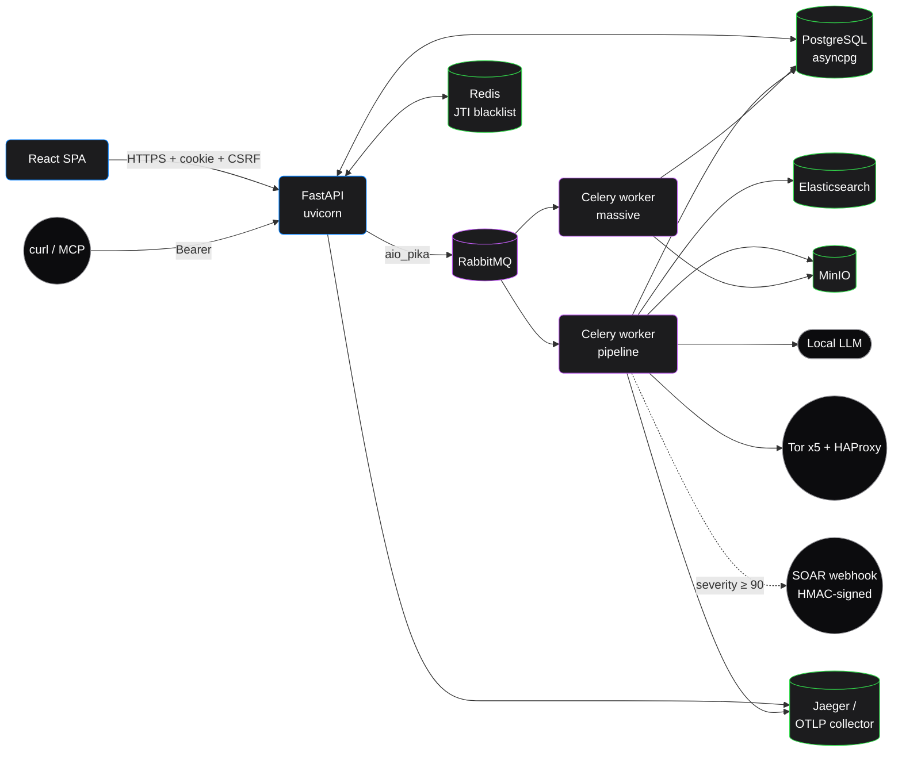
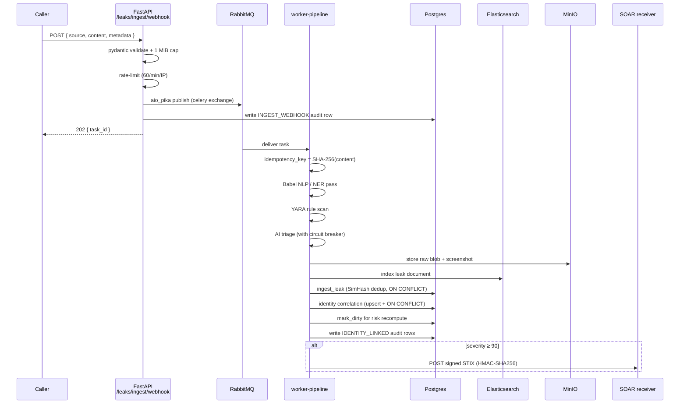
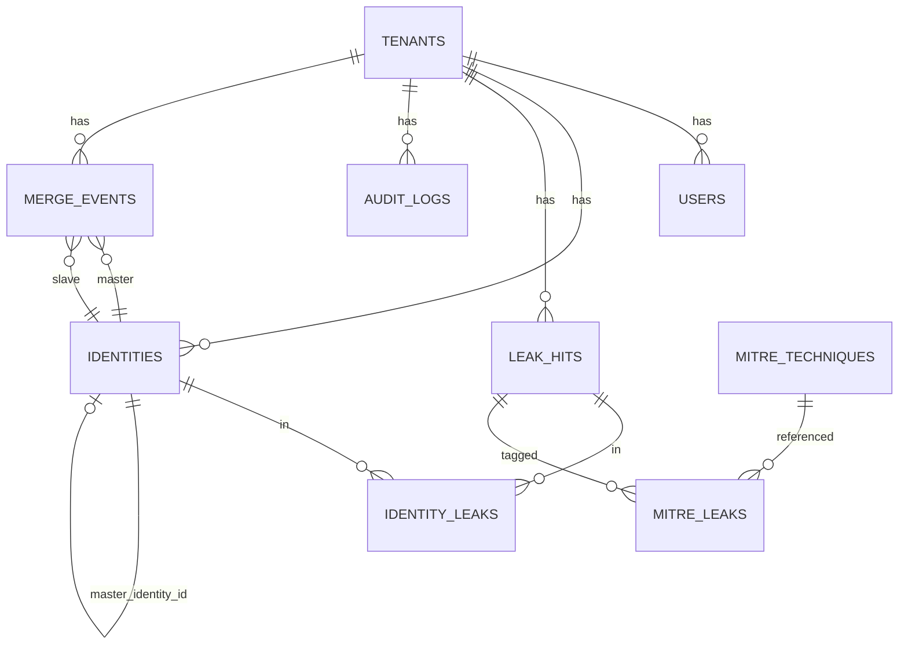

# Architecture

Runtime layout, the data flow for a single leak, and the schema of the two append-only ledgers (audit + merge events).

## Runtime layout



Boundaries:

- **API process**: stateless. Anything in-process (the CSRF middleware, the per-tenant audit lock) survives only within the request scope.
- **Worker processes**: own their own engine + session pool (`NullPool`, see [`shared/tasks/pipeline.py`](https://github.com/fabriziosalmi/naso/blob/main/shared/tasks/pipeline.py) for why). Two queues: `default + osint` for the regular pipeline, `massive` for streaming bulk processors that must be single-concurrency.
- **Tor cluster**: bridge-network only. Dark-web egress goes through HAProxy → 5 Tor instances. There is no clearnet escape hatch from the workers other than this proxy.

## Leak ingestion: end-to-end



Idempotency key is the SHA-256 of the raw content. Two ingests of the same dump go through Babel + YARA + AI exactly once; the second collapses on the existing `LeakHit` row via `ingest_leak`'s `ON CONFLICT DO NOTHING` (see [`shared/domain/services/leak_ingest.py`](https://github.com/fabriziosalmi/naso/blob/main/shared/domain/services/leak_ingest.py)).

Near-duplicate dedup uses 64-bit SimHash + a Hamming distance threshold of ≤ 3. A breach dump that re-emerges with whitespace/line-ending differences gets folded into the same row instead of duplicating.

## Storage hierarchy

| Store         | Owns                                                                                  |
|---------------|---------------------------------------------------------------------------------------|
| **PostgreSQL**| Tenants, users, keywords, identities, identity_leaks (M:N), leak_hits, merge_events, audit_logs, MITRE techniques, YARA rules, webhooks, investigation plans + tasks |
| **Elasticsearch** | Full-text index over leak content + metadata. Source of truth is still Postgres — ES is rebuildable. |
| **MinIO**     | Raw content blobs, forensic screenshots, exported dossier PDFs. One bucket per tenant. |
| **Redis**     | JWT JTI blacklist (TTL = remaining token lifetime); dark-web result cache with bounded size + TTL. |

## The two ledgers

NASO's tamper-evident posture rests on two append-only tables, both per-tenant hash-chained.

### `audit_logs` (every analyst action)

```
┌──────────────┬──────────────┬──────────────┐
│  prev_hash   │              │              │
│      ↓       │              │              │
│  ┌────────┐  │  ┌────────┐  │  ┌────────┐  │
│  │ row 0  │──┼─→│ row 1  │──┼─→│ row 2  │  │
│  └────────┘  │  └────────┘  │  └────────┘  │
│              │              │              │
└──────────────┴──────────────┴──────────────┘
              tenant A
```

`self_hash = SHA256(canonical-json(tenant_id, user_id, action, resource_type, resource_id, details, timestamp, prev_hash))`. Tampering anything in the row changes `self_hash`; tampering the previous row breaks `prev_hash`. Verification walks the chain and reports the first failing row.

Concurrency: `pg_advisory_xact_lock(hashtext(tenant_id))` for cross-process serialization, `asyncio.Lock` per tenant for in-process. Both required: SQLite tests rely on the asyncio lock alone; Postgres prod relies on both.

### `merge_events` (every identity merge)

Same chain semantics. Each row carries the `evidence` JSON array (e.g. `{"type":"shared_leak", "leak_id":"...", "strength":0.8}`), aggregate `confidence`, and a `reversed_at` field for soft reversal — the ledger stays append-only. See [`shared/domain/services/entity_resolution.py`](https://github.com/fabriziosalmi/naso/blob/main/shared/domain/services/entity_resolution.py) for the merge logic and [`shared/domain/services/merge_proposer.py`](https://github.com/fabriziosalmi/naso/blob/main/shared/domain/services/merge_proposer.py) for the candidate-pair selector.

## Schema (key tables)



Notable design choices:

- `Identity.normalized_identifier` is the canonical key (Gmail dot/plus folded, domain lowercased, phone digits-only). The unique constraint is on `(tenant_id, type, normalized_identifier)`, so two analysts ingesting the same email in different surface forms create one row.
- `Identity.master_identity_id` self-references for merge clusters. Risk computation walks up the cluster.
- `LeakHit.simhash64` is indexed; near-duplicate lookups are fast.
- `AuditLog` and `MergeEvent` carry `prev_hash` + `self_hash`; the rest of the columns are normal data.

The full SQLAlchemy declarations live in [`shared/models.py`](https://github.com/fabriziosalmi/naso/blob/main/shared/models.py).

## Worker separation

| Worker             | Queues          | Concurrency | Job                                                                  |
|--------------------|-----------------|-------------|----------------------------------------------------------------------|
| `worker-pipeline`  | `default, osint`| 4           | Standard ingest, identity correlation, dark-web probes, GitHub scans |
| `worker-massive`   | `massive`       | 1           | Streaming bulk-blob processors (gigabyte-scale)                      |

Massive jobs run single-concurrency by design: their working set already fills the machine, parallelism just OOMs faster.

The `task_routes` in `shared/celery_app.py` map task name patterns to queues. Each task that needs to run on the massive queue must declare an explicit `name="tasks.massive.<...>"` so the routing pattern matches.

## Observability

- **Distributed tracing**: every API request and Celery task starts an OpenTelemetry span; cross-process trace context propagates via the AMQP message headers. The Co-Analyst loop wraps each iteration in an `agent_turn` span and each tool call in a `tool_span`, with attributes for `parallel`, `iteration`, `tenant_id`. Dashboards: see the [Runbook](runbook.md).
- **Sentry**: opt-in via `SENTRY_DSN`. The global FastAPI exception handler captures uncaught exceptions, downgrading to a 500 with no stack trace in the response.
- **Audit chain**: see above. The integrity check is itself observable — a `BROKEN_CHAIN` event lands in the audit log when a verification request fails.

## Code map

| Where                                          | What                                                              |
|------------------------------------------------|-------------------------------------------------------------------|
| `backend/app/main.py`                          | FastAPI app, middlewares (CSRF / CORS / TrustedHost / sec headers) |
| `backend/app/api/endpoints/`                   | One file per resource (`auth`, `leaks`, `identities`, …)           |
| `backend/app/csrf.py`                          | Double-submit cookie middleware                                    |
| `shared/config.py`                             | Pydantic Settings (single source of truth)                         |
| `shared/database.py`                           | API-side async engine + session                                    |
| `shared/models.py`                             | All ORM models                                                    |
| `shared/celery_app.py`                         | Celery app + queue routing                                        |
| `shared/tasks/`                                | One module per task family (pipeline, darkweb, github, …)          |
| `shared/domain/services/`                      | Business logic (correlation, merge, identity_upsert, audit_chain) |
| `shared/utils/`                                | Cross-cutting (audit, reporting, tracing, circuit_breaker, …)      |

If a change spans more than one of these, it likely belongs in the corresponding domain service, not in an endpoint handler.
